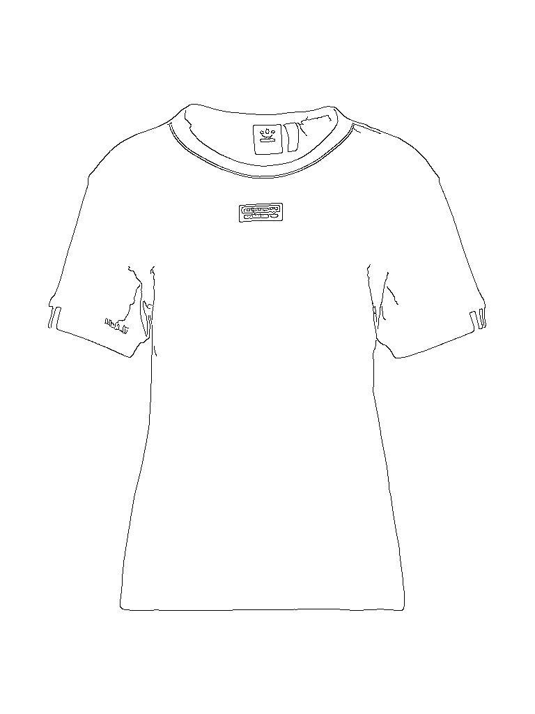
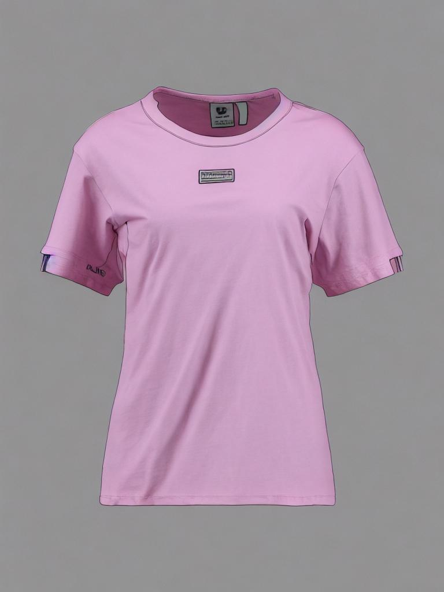
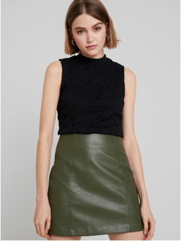
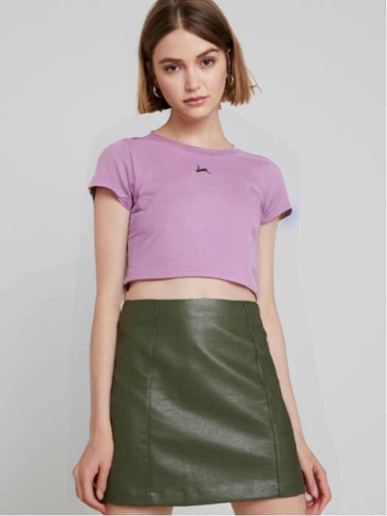
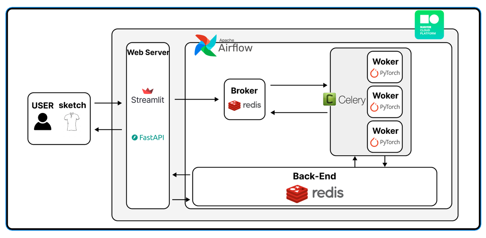

# AI Design Assistant
## 프로젝트 소개
옷 스케치와 그에 대한 설명을 통해 옷 이미지를 생성하고, 생성된 옷 이미지를 모델 이미지에 입히는 서비스를 제공합니다.
## 프로젝트 배경과 목적
옷 제작에 많은 시간과 비용이 들기 때문에 생성형 AI를 통해 옷 스케치로부터 바로 결과를 볼 수 있게 함으로써 옷을 제작하고 수정하는 시간과 비용을 절감하도록 돕는다.
## 데이터
### 데이터 수집
+ [VITON-HD Multimodal](https://github.com/aimagelab/multimodal-garment-designer)
### 데이터 제작
+ Canny Edge Detection으로 스케치 이미지 직접 제작
+ Image Captioning을 통한 옷 이미지의 설명 직접 제작

## Result
| Input | → | Output |
|--------|---|-------|
|  | → |  |
| "The cloth is a pink shirt, and it is made of cotton." |
|   | → |  |

## Service

